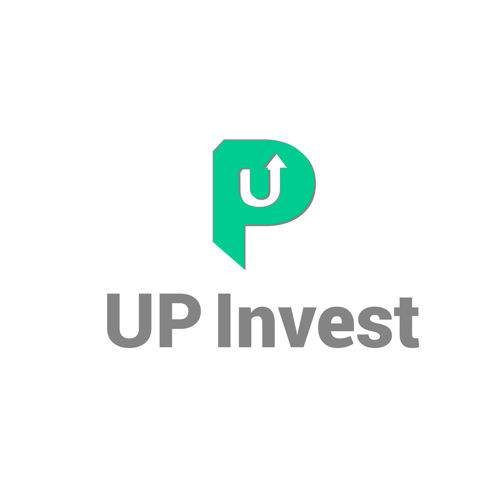
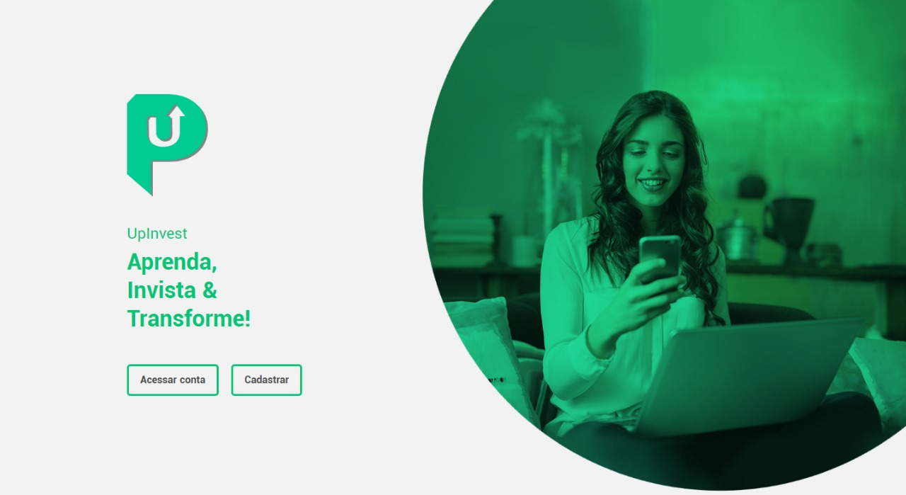
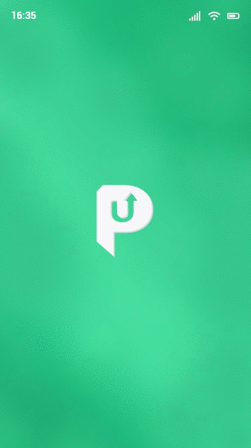

<h2 align="center">
    
</h2>

 

    

<h4 align="center">
  Mega Hack Shawee - XP Inc. 
</h4>
<h5 align="center">
  Online, 7 de Fev de 2020
</h5>

  :green_heart: <a href="#green_heart-o-projeto">O projeto</a>&nbsp;&nbsp;&nbsp;|&nbsp;&nbsp;&nbsp;
  :wink: <a href="#wink-descrição">Descrição</a>&nbsp;&nbsp;&nbsp;|&nbsp;&nbsp;&nbsp;
  :iphone: <a href="#iphone-protótipo-mobile">Protótipo mobile</a>&nbsp;&nbsp;&nbsp;|&nbsp;&nbsp;&nbsp;
  :computer: <a href="#computer-tecnologias">Tecnologias</a>&nbsp;&nbsp;&nbsp;|&nbsp;&nbsp;&nbsp;
  :scroll: <a href="#scroll-iniciando-a-aplicação"> Iniciando a aplicação </a>

 
 

## :green_heart: O Projeto

No Mega Hack Shawee escolhemos o desafio da XP Inc onde tratamos sobre investimentos através de uma ideia para que até mesmo os que não conhecem bem sobre o assunto, pudesse de uma forma dinâmica aprender e investir ao mesmo tempo.

 

## :wink: Descrição

Up Invest é uma plataforma desenvolvida para ajudar as pessoas a assumirem o controle de sua vida financeira, adquirindo conhecimento através de fases e etapas de uma forma mais dinâmica, despertando o interesse e assim fazendo com que se sintam mais seguros a investir por meio da própria plataforma. Com isso, aprender investindo é o objetivo da Up Invest.

 

    

 

## :iphone: Protótipo Mobile

    

 

## :computer: Tecnologias
- [Nuxtjs](https://nuxtjs.org/)
- [Sass](https://sass-lang.com/)
- [Pug](https://pugjs.org/api/getting-started.html)

 

## :scroll: Iniciando a aplicação

Clone o repositório para sua máquina usando o comando `git clone https://github.com/juliannevolotao/up-invest-megahack.git` no local desejado através do terminal. Em seguida acesse a pasta do projeto com o comando `cd up-invest-megahack`.

**1.** Em seguida através do terminal use `yarn dev` ou `npm run dev` para rodar o projeto. Se tudo ocorrer bem abra [http://localhost:3000](http://localhost:3000) no navegador para visualizar o projeto

 
 

<h5 align="center">
  :heart: Front-end e protótipos desenvolvido por Julianne Volotão.
</h5>

 
 
